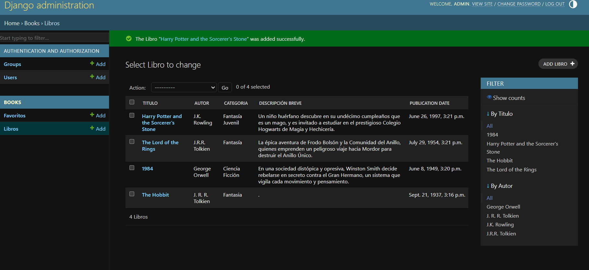

# 📚 EcoLibrary - Sistema de Gestión de Biblioteca y API REST

**EcoLibrary** es un sistema backend desarrollado en Python y Django que centraliza la información de libros y automatiza la obtención de metadatos. Está diseñado bajo una arquitectura modular orientada al desarrollo de APIs y a la correcta gestión de datos relacionales.

## 🚀 ¿Qué se construyó? (Características Principales)

- **Integración de API Externa:** Consume de forma asíncrona la API pública de _Open Library_ para autocompletar información vital (portadas, calificaciones y años de publicación) basándose únicamente en el título del libro.
- **API RESTful Propia:** Expone los datos de la biblioteca mediante **Django REST Framework (DRF)**, permitiendo que cualquier frontend o aplicación móvil consuma la información estructurada en formato JSON.
- **Control de Usuarios y Favoritos:** Sistema de autenticación que permite a los usuarios gestionar su propia lista de libros favoritos con protección de rutas.

---

## 📸 Vistas del Proyecto (Demo visual)

**1. Interfaz Principal y Consumo de API externa**
https://github.com/user-attachments/assets/c52ac748-6c2d-46df-9f25-c262ea310161

**2. API REST interna (Django REST Framework)**
https://github.com/user-attachments/assets/6d808ee2-3326-4664-9275-d3ed22817ce0

**3. Seguridad y Control de Datos**

---

## 🧠 Valor Técnico y Aprendizajes (Por qué este proyecto importa)

Durante el desarrollo de este proyecto, apliqué conocimientos directamente enfocados a requerimientos reales de la industria Backend:

- **Desarrollo Backend y Base de Datos:** Modelado de datos relacionales robustos usando el ORM de Django, garantizando la trazabilidad, rendimiento e integridad de la información.
- **Arquitectura y Consumo de APIs:**
    - Manejo seguro de peticiones HTTP (`requests`) a servicios de terceros, implementando _timeouts_, validaciones y manejo de errores para evitar caídas del sistema.
    - Diseño y mantenimiento de endpoints RESTful con serializadores para la comunicación entre módulos.
- **Seguridad y Control de Acceso:** Implementación de permisos estrictos en la API. Las rutas de lectura son públicas (`AllowAny`), pero las acciones de escritura, actualización o borrado requieren privilegios de administrador (`IsAdminUser`).
- **Buenas prácticas y Código Limpio:** Uso intensivo de _Type Hinting_ en Python para asegurar la predictibilidad del código, modularidad, y documentación de funciones mediante _Docstrings_.

---

## 🛠️ Stack Tecnológico

- **Lenguaje:** Python 3
- **Frameworks:** Django, Django REST Framework (DRF)
- **Base de Datos:** SQLite / PostgreSQL
- **Integraciones:** Open Library API
- **Control de versiones:** Git

---
